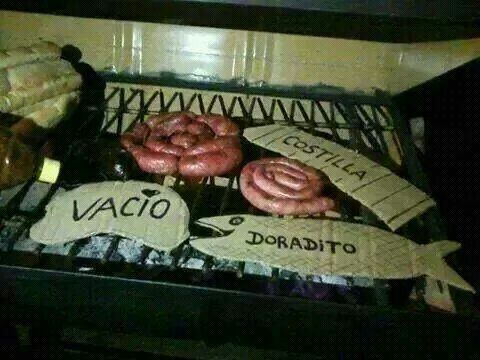

# Kata: Predicados y Variables

- `TODO: Agregar badge`
- Gaspar Habif (gasparhabif)

## Parrilla 

Tenemos que modelar la siguiente información que recibimos:

Una parrilla ofrece a sus comensales las siguientes variedades

- chinchulines
- mollejas
- chorizo
- morcilla
- asado de tira
- vacío
- bondiola
- papa al plomo
- provoleta

Los vegetarianos solo comen papa al plomo y provoleta.
Las mollejas y los chinchulines son menúes caros.
 
Nos piden conocer:

- Los gustos que comería Jocelyn, que solo come mollejas o platos vegetarianos
- Los gustos que come Jean Gourmet, que come menúes caros y asado de tira, pero nunca vacío.

> **Para pensar:** ¿cómo se modela que Jean Gourmet no come vacío? ¿Con qué concepto está relacionado?

- Indique cuál es la consulta para saber los menúes que comerían Jocelyn y Jean Gourmet.

> El testeo unitario es opcional, debe quedar claro cómo resuelve los requerimientos pedidos (qué consultas se hacen).
